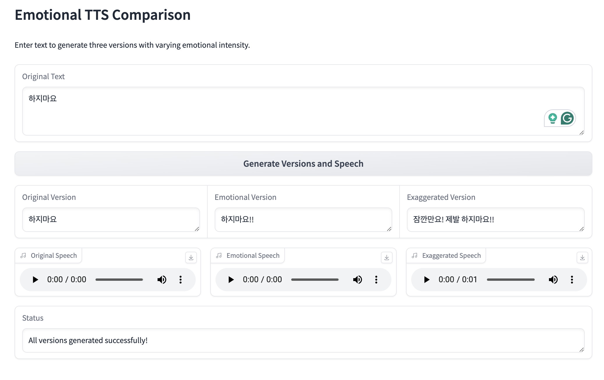

# Emotional TTS Comparison

This project explores ways to incorporate emotion into Text-to-Speech (TTS) using OpenAI's GPT-4o-mini for text modification and TTS-1 for speech synthesis.

## Background

While some TTS systems like Bark can include descriptive elements in speech (e.g., "(큰 소리로) 위험해요!"), they may have quality issues with noise. This project aims to find a method to convey emotion using OpenAI's TTS while maintaining high audio quality.

## How It Works

1. The user inputs a text.
2. The system generates three versions of the text:
   - Original: The input text as-is
   - Emotional: A slightly more emotional version
   - Exaggerated: A highly emotional, exaggerated version
3. Each version is then converted to speech using OpenAI's TTS-1 model.

## Example

Original: "위험해요"
Emotional: "위험해요!!"
Exaggerated: "잠깐만요! 안돼, 위험해요!!"

## Features

- Uses GPT-4o-mini for text modification
- Employs OpenAI's TTS-1 for high-quality speech synthesis
- Provides a Gradio interface for easy interaction
- Allows comparison of different emotional intensities in speech

## Usage

1. Enter your text in the input box.
2. Click "Generate Versions and Speech".
3. Listen to and compare the three versions of the speech.

## Deployment

This project is deployed on Hugging Face Spaces, allowing easy access and usage without local setup.

## Note

This approach aims to strike a balance between conveying emotion and maintaining speech quality. It demonstrates how text modification can influence the perceived emotion in TTS output.